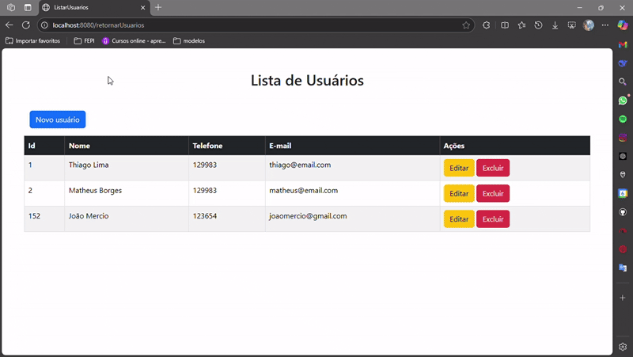

# microprojeto-frontendFirstCrudJava



Este projeto tem como objetivo demonstrar como consumir uma API REST utilizando Spring Boot no frontend, com Thymeleaf para renderização de páginas e Bootstrap para estilização.


## Tecnologias Utilizadas

- **Java 17**
- **Spring Boot 3**
  - Spring Web
  - Spring Boot DevTools
  - Thymeleaf
- **Bootstrap 5**
- **Maven**

## Estrutura do Projeto

```md
crud_usuario/
├── src/
│   ├── main/
│   │   ├── java/
│   │   │   └── com.frontend.crud_usuario/
│   │   │       ├── controller/
│   │   │       │   └── UsuarioController.java
│   │   │       └── model/
│   │   │           └── Usuario.java
│   │   └── resources/
│   │       └── templates/
│   │           ├── listar.html
│   │           ├── cadastrar.html
│   │           └── editar.html
│   └── test/
├── pom.xml
└── README.md

```


## Funcionalidades

- Listar usuários
- Cadastrar novo usuário
- Editar usuário existente
- Deletar usuário

## Como Executar

1. **Clone o repositório:**
   ```sh
   git clone https://github.com/ThiagoLimaC/microprojeto-frontendFirstCrudJava.git
   ```
2. **Acesse a pasta do projeto:**
    ```
    cd microprojeto-frontendFirstCrudJava/crud_usuario:
    ```` 

3. **Instale as dependências e compile::**
    ```
    mvn clean package
    ```` 

4. **Execute a aplicação:**
    ```
    mvn spring-boot:run
    ```` 

5. **Acesse no navegador:**
    ```
    http://localhost:8080/retornarUsuarios
    ```

> **Observação:** Certifique-se de que a API backend (http://localhost:8083/api/usuarios) esteja rodando para que o frontend funcione corretamente.


**Configuração do Banco de Dados**

Este projeto consome uma API externa e não possui integração direta com banco de dados. O backend responsável pela API deve estar ativo e acessível.

**Personalização**

Os arquivos de template estão em src/main/resources/templates.
O CSS é carregado via CDN do Bootstrap.